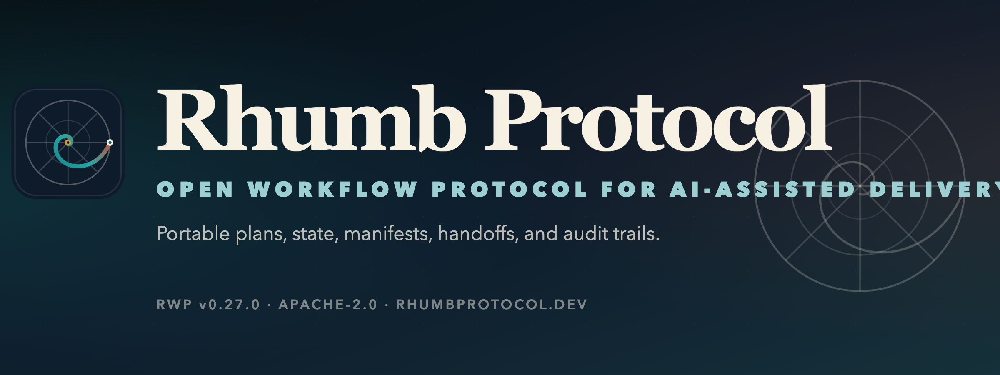

  

# Rhumb Workflow Protocol™

## The main repo will be available in a day or two.

>Some links may appear broken because they are pointing to private repositories.

**Open workflow protocol for AI-assisted delivery.**

Rhumb Workflow Protocol&trade; (RWP™) defines the plain-file contract for durable
AI-assisted work: intakes, plans, execution state, manifests, handoffs,
architecture artifacts, templates, schemas, and conformance checks that survive
across tools, agents, vendors, and sessions.

[rhumbprotocol.dev](https://rhumbprotocol.dev) |
[Specification](https://github.com/rhumbprotocol/specs/blob/main/docs/PROTOCOL.md) |
[Getting started](https://github.com/rhumbprotocol/specs/blob/main/docs/GETTING-STARTED.md) |
[Conformance](https://github.com/rhumbprotocol/specs/blob/main/docs/CONFORMANCE.md)

---

## What RWP™ Standardizes

| Area | RWP™ artifact |
|---|---|
| Request capture | `INTAKE.yaml` |
| Executable plan | `PLAN.md` |
| Runtime progress | `state.yaml` |
| Produced evidence | `manifest.yaml` |
| Dependency graph | `dependencies.yaml` |
| Session/phase continuity | `HANDOFF.yaml` |
| Architecture path | `IDEA -> AVD -> ACS -> MP` |
| Conformance | `rhumb-validate` |

RWP™ uses `MP-NNNN-short-name` plan identifiers, current-only state
vocabulary, and canonical RWP™ template names such as `AVD.md.template`,
`ACS.md.template`, `HANDOFF.yaml.template`, `AUDIT.md.template`, and
`FINAL.md.template`.

---

## Relationship To Meridian™

[YAKKL® Meridian™](https://meridian.yakkl.com?utm_source="RPW_Org_page") is the [YAKKL®](https://yakkl.com) reference implementation for RWP™ supported workflow
surfaces. It proves the protocol in a real toolchain, but it does not own the
protocol. 

RWP™ stays vendor-neutral.

---

## Repositories

| Repository | Purpose |
|---|---|
| [specs](https://github.com/rhumbprotocol/specs) | Protocol specification, schemas, templates, examples, integrations, validator, and governance |

---

## Contribute

- Read the [protocol specification](https://github.com/rhumbprotocol/specs/blob/main/docs/PROTOCOL.md).
- Start with the [getting started guide](https://github.com/rhumbprotocol/specs/blob/main/docs/GETTING-STARTED.md).
- Check conformance rules in [CONFORMANCE.md](https://github.com/rhumbprotocol/specs/blob/main/docs/CONFORMANCE.md).
- Open issues using the repo templates so validator failures, spec changes, docs work, and implementation questions stay triageable.

---

## License And Marks

The Rhumb Workflow Protocol™ specification and validator are licensed under
Apache-2.0. Rhumb™ names, marks, and visual identity are trademarks of YAKKL®,
Inc. and are governed separately by the repository trademark policy.

